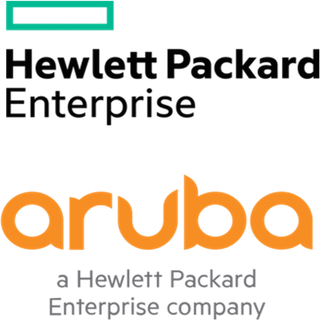

# About

Hi, I am Mirav (pronounced *mee-ruh-av*)

I helm two hats as Engineering manager / Technical product manager at a HealthTech Stealth Startup. Currently
building Data lakes, Knowledge graphs consisting of ~800 million nodes, relationships, data points 
for accurate search and insightful analytics.

By night, I kung-fu, building microservices, platform infrastructure (_mostly_ [Go](https://go.dev/)).
When I'm not conquering the tech world, you'll find me on the badminton court or football pitch,
shaking up [Hendricks gin](https://www.hendricksgin.com/)
for friends and family, planning for un-planned road trips.  
And yes, spill some digital ink [here](blog/index.md).

Previously at :

{align=left}

[Uptycs](https://www.uptycs.com/), March 2023 - Aug 2023

— Lead Software Engineer

- Part
  of [CSPM](https://www.uptycs.com/products/cnapp/cspm)
  team, I help build Network Vulnerabilities, threat detection sys and lateral attack paths close to real
  time for Azure, K8s

-----
{align=left}

[Rafay Systems](https://rafay.co/), Aug 2021 - Aug 2023

— Senior / Lead Software Engineer (IC)

- Early hire, played multiple hats
- Build [Cluster Overrides](https://docs.rafay.co/cli/overrides/), [Soft Multi-tenancy for granular RBAC / ABAC access](https://docs.rafay.co/security/tenancy/overview/#soft-tenancy), [K8s workload selection](https://docs.rafay.co/cli/overrides/),
Custom CRD’s

-----
{align=left}

[Aruba - HPE](https://www.hpe.com/us/en/home.html), Aug 2017 - Aug 2021

— Intern, Software Developer 2

- Part of HPE acquiring Aruba Networks
- Build [NMS](https://www.arubanetworks.com/products/network-management-operations/central/) (Network Management System) and customer notification service
- Developed dedicated CD/CI pipeline’s for package management, common-library’s, notification
- Managed ~20 sensitive microservices, User Signup / Logout and Device onboarding, Licence Management
- Build API’s and GRPC services to support SD-WAN devices

