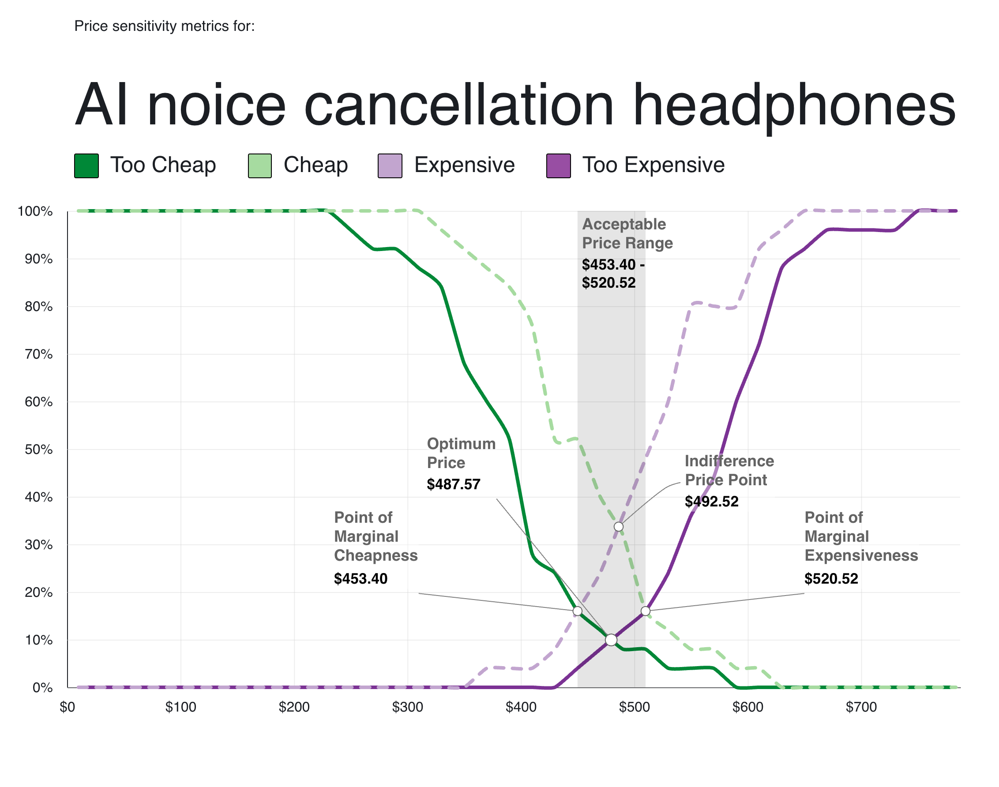

# Mastering the Art of Value-Based Pricing

<!-- more -->

Let’s say [Boat](https://www.boat-lifestyle.com/) starts selling its wireless headphone at **$720** ( ~₹60K), would you
buy it ?

— I doubt, one might at this point of time.…

Hypothetically, what if [Bose](https://www.bose.com/home) sells at same price point ?

— Most likely, people might … a little hesitant, but still….

How do you know if your customers want to pin their money that’s priced at **$720**. These pricing numbers can have
emotional meanings associated with them. $720 could be

---

1. Way **too cheap** — Just take my money !
2. **Cheap**— Bang for the buck
3. Hmm, **getting expensive**— Ahh ... ain’t a bad deal ?
4. **Too expensive**— Out of my league

---

Customers are price sensitive ! Somehow instincts is wired to flash the image of brand first, and then the price that...
comes with it.

> Emotion == perceived value

How do you know the perceived value for product/service that customers are willing is fair price to pay for ? — we don't
know yet, but we can try to find out using PSM (Price Sensitivity Meter)

### Price Sensitivity Meter

probably one of the finest marketing technique for determining consumer price
preferences; helps determine psychologically acceptable range of price that customers are willing to pay.

#### When to use it?

1. Assess what price range the market considers to be fair for your product
2. Need quick and quantitative results

#### Modelling PSM

##### Step 1: Build the questionnaire

[Van Westendorp’s Price Sensitivity Meter](https://en.wikipedia.org/wiki/Van_Westendorp%27s_Price_Sensitivity_Meter) is
one of a number of **direct** techniques to research pricing. Direct techniques assume that people have some
understanding of what a product or service is worth, and therefore that it makes sense to ask explicitly about price.

There are three _direct_  pricing research methods:

1. **Laddering**   _Would you buy at $720? then would you buy at $ 950? or would you still buy at $ 720?_

      > This approach brings scepticism, these questions are often sensed as  
      > negotiations strategy than pinning the price customers wants to pay
   
2. **Direct open-ended questioning**   _How much would you pay for this ?_

    > Bad way to ask, might not help on why X amount was pinned for this, puts on ambiguity if looked at quantity way.
    > Might help with if further interviews to understand the perceived value seen by customers on why X value was
    > pinned
   
3. **Monadic**   _Would you be willing to buy at $720?_

    > This strategy lets you pull exact data points from multiple customers.
    > customer may not perceive this worth $720; hence a pre-survey would be helpful to narrow down range of
    > prices customers wants to pay to.

One of the examples — AI noise cancellation Headphone:

[https://2xhb3sfk2v4.typeform.com/to/tlIiHPHN](https://2xhb3sfk2v4.typeform.com/to/tlIiHPHN)

##### Step 2:  Aggregating the data

The collected data from survey form would look in given table below

| Respondents | Too Cheap | Cheap | Getting Expensive | Too Expensive | Data Validity |
|-------------|-----------|-------|-------------------|---------------|---------------|
| 1           | 300       | 400   | 500               | 900           | valid         |
| 2           | 300       | 300   | 550               | 800           | valid         |
| 3           | 100       | 200   | 1000              | 800           | In-valid      |
| 4           | 200       | 400   | 700               | 950           | valid         |
| 5           | 200       | 500   | 650               | 1000          | valid         |
| 6           | 300       | 400   | 500               | 900           | valid         |
| 7           | 300       | 300   | 550               | 800           | valid         |
| 8           | 450       | 500   | 700               | 950           | valid         |
| 9           | 250       | 400   | 700               | 950           | valid         |
| 10          | 300       | 550   | 650               | 1000          | valid         |
| 11          | 100       | 200   | 500               | 900           | valid         |
| 12          | 300       | 350   | 550               | 800           | valid         |
| 13          | 100       | 200   | 1000              | 800           | In-valid      |
| 14          | 200       | 450   | 700               | 950           | valid         |
| 15          | 400       | 500   | 650               | 1000          | valid         |

Respondents data is valid **ONLY**:

    IF (Too cheap <= Bargain <= Getting Expensive <= Too Expensive)

**In-valid** data means customers have not understood the questionnaire or have limited knowledge on the product space
to assign the appropriate value. I think it would be safe to say to scrap off in-valid data off while calculating survey data

##### Step 3: Graph Analysis

Once the data is collected as part of step 2, we can start to analyze the data using

1. [Microsoft excel](https://themaykin.com/blog/a-complete-guide-to-van-westendorp-how-to-graph-it-in-excel)
2. [Conjointly](http://conjointly.com/products/van-westendorp/)

A sample graph would look like this :

**X-axis**:  Shows all monetary values  
**Y-axis**:  Shows the percentage of respondents  
**PMC**:     Point of Marginal Cheapness  
**PME**:     Point of Marginal Expensiveness

The right-most the intersection (Cheap and Too expensive) defines the upper bound of the range

**Optimum price**  
The bottom intersection of *Too cheap* and *Too expensive* defines as % of respondents think price as
either *Too expensive or Too cheap*

     PMC ≤ Acceptable Price range ≤ PME

The apt price range is between  $ 537.76 - $ 601.53

One may argue to have _Optimum price_ as its **exact price**; 
yet too risky to bring perfection in real world and possibility of losing the customer at once

##### Step 4: Additional Analysis (Optional)

The analysis only identifies the price range customers are willing to pay, but not whether they will pay. At a price between the price identified as a cheap and the price said was getting expensive, how likely would you be to purchase?

1. Very unlikely
2. Unlikely
3. Unsure
4. Likely
5. Very Likely

With this question, assigning an arbitrary value for varying options, one could collect results and take an informed
call on how likelihood expected percentage of purchase is going to be

##### Graph Evaluation

- ~25% respondents perceive $420 is *too cheap*
- Post $410, respondents think, its getting *expensive*
- ~52% respondents perceive its still *cheap at* $453.40
- At $520.52 , ~50% respondents thinks it's expensive, ~18% respondents think its cheap

#### Conclusion

The **Acceptable Price range** price ranges from** $453.40 - $520.52**

One may argue to pin **Optimum price** should be price one should sell for i.e. $487.57; yet little risky to bring
perfection into real world; though this maybe a subjective call.

